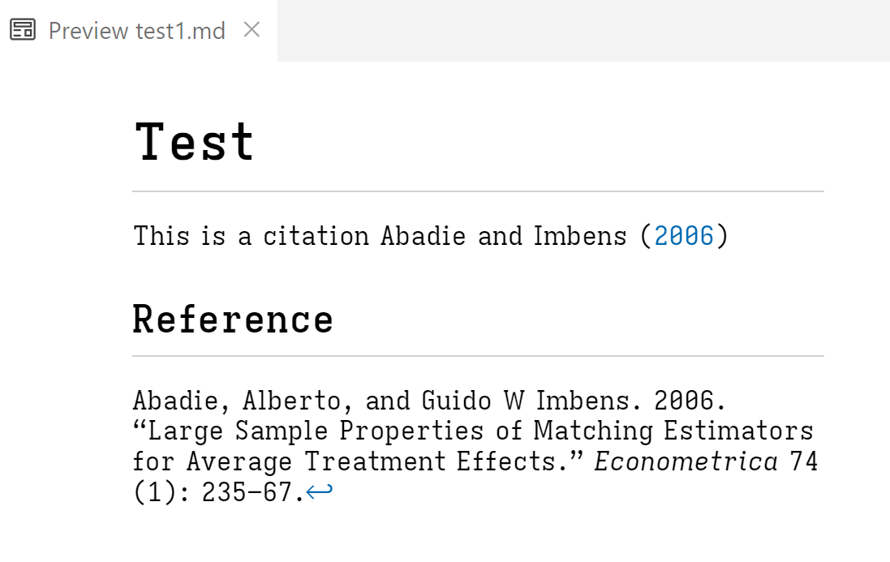

# Hugo Citation Back Links

*Hugo Citations Back Links* is a Lua filter that adds back links (↩) to Hugo
citations when processing Markdown files. This way users can get back into the
flow after clicking on a citation.

For portability of your markdown files the solution tries to stay as close to
GitHub Flavored Markdown and HTML as possible, avoiding Hugo shortcodes.

## Features

- Fewer dependencies: No need to use Hugo extensions
- Portable: Your content files stay close to Markdown and HTML

## Installation

1. Install [Pandoc](https://pandoc.org/), which includes [Lua](https://www.lua.org/).
1. Add `backlink1.lua` to Hugo's `static` folder.
1. Not needed but useful: Install the [vscode](https://github.com/microsoft/vscode)
   extension [Pandoc Citer](https://marketplace.visualstudio.com/items?itemName=notZaki.pandocciter).
   Enables autocomplete suggestions for inserting citation keys in your markdown
   file as you write.

## Usage

1. Create a new markdown file in Hugo's content folder:
   ```
   hugo new blog/test.md
   ```
2. Add bibliography to `test.md` YAML.  Example:
   ```markdown
   ---
   title: 'Test'
   date: '2025-02-11'
   author: 'Joe Doe'
   draft: true
   tags:
     - citations
   slug: test
   bibliography: C:\Users\Joed\Documents\my bibliography\bibliography.bib
   ---

   # Test
   
   This is a citation @Abadie2006
   
   ## Reference

   ```
3. Process `test.md` to render the bibliography with back links:
   ```bash
   pandoc --standalone --citeproc -t gfm --metadata link-citations 
   --bibliography="C:\Users\Joed\Documents\my bibliography\bibliography.bib" 
   --lua-filter=./static/backlink1.lua 
   "./content/blog/test.md" -o "./content/blog/test1.md"
   ```

Here is what the processed file `test1.md` looks like"

```
---
author: Joe Doe
bibliography: "C:\\Users\\Joed\\Documents\\my bibliography\\bibliography.bib"
date: 2025-02-11
draft: true
link-citations: true
slug: test
tags:
- citations
title: Test
---

# Test

This is a citation <span id="cite-Abadie2006"></span>Abadie and Imbens
([2006](#ref-Abadie2006))

## Reference

<div id="refs" class="references csl-bib-body hanging-indent"
entry-spacing="0">

<div id="ref-Abadie2006" class="csl-entry">

Abadie, Alberto, and Guido W Imbens. 2006. “Large Sample Properties of
Matching Estimators for Average Treatment Effects.” *Econometrica* 74
(1): 235–67.<a href="#cite-Abadie2006">↩</a>

</div>

</div>

```

Which renders like:



## Contributing

[Here's how](https://github.com/firstcontributions/first-contributions).

## Acknowledgements

- [Claude 3.5 Sonnet](https://www.anthropic.com/news/claude-3-5-sonnet)
- [Pandoc](https://pandoc.org/)

## License

MIT 2025 Fernando Martel García
